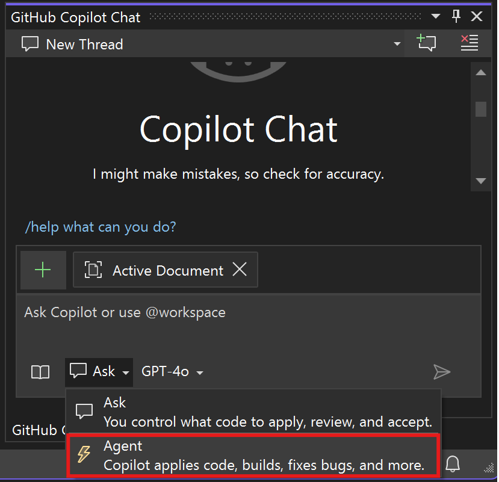
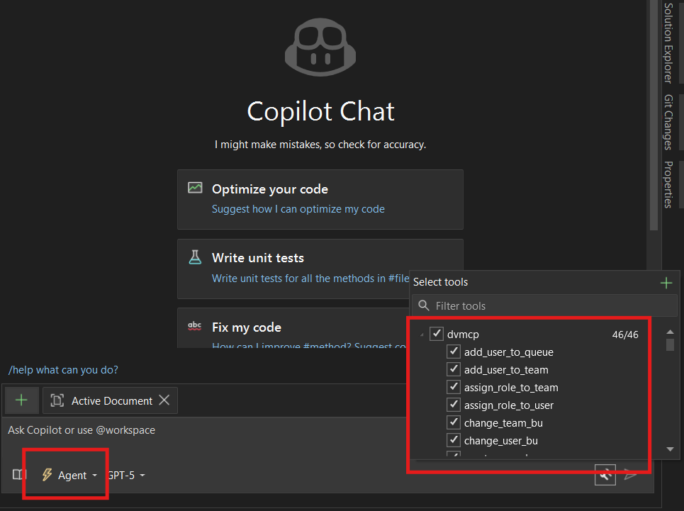

# Setup Dataverse DevTools MCP Server in Visual Studio

- Create a new .mcp.json file in the path (if not already present):  %USERPROFILE%\\.mcp.json. We recommend that you use Visual Studio to edit this file so that its JSON schema is automatically applied.

- Paste the following contents into the .mcp.json file. Save the file.

```
{
  "servers": {
    "dvmcp": {
      "type": "stdio",
      "command": "dataversedevtoolsmcpserver",
      "args": [
        "--environmentUrl",
        "https://<your-environment>.crm.dynamics.com"
        ]
    }
  }
}

```

For Corporate Proxy Network

```
{
  "servers": {
    "dvmcp": {
      "type": "stdio",
      "command": "dataversedevtoolsmcpserver",
      "args": [
        "--environmentUrl",
        "https://org09d97b98.crm8.dynamics.com"
        ],
        "env":{
          "HTTP_PROXY": "http://<username@domain.com>:<password>@<proxy.domain.com>:8080",
          "HTTPS_PROXY": "http://<username@domain.com>:<password>@<proxy.domain.com>:8080"
        }
    }
  }
}

```
- In Visual Studio, select the Ask arrow in the GitHub Copilot Chat window, and then select Agent.



- Select the dvmcp tools.



- Try a sample prompt: Get my user details in dataverse.

- Copilot asks for permission to use a tool that the MCP server made available to it. Select Allow with the scope that you want to proceed with.

