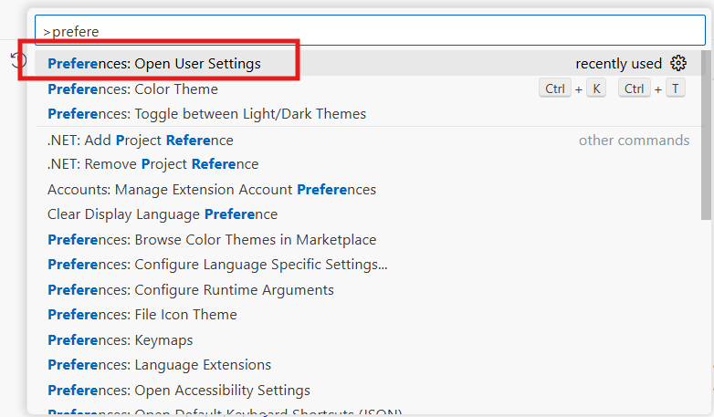
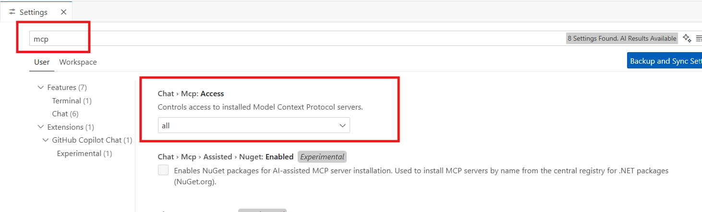
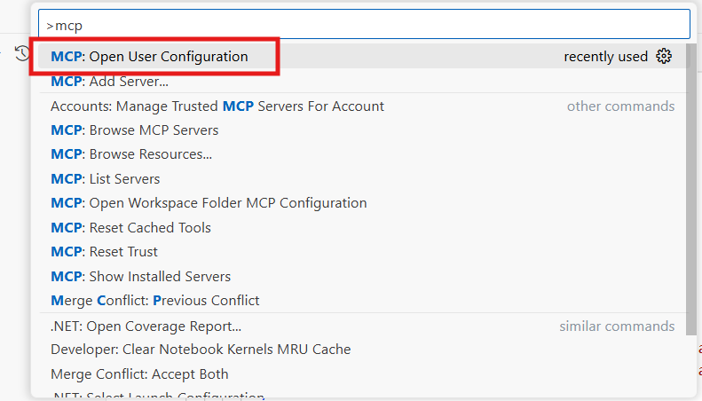
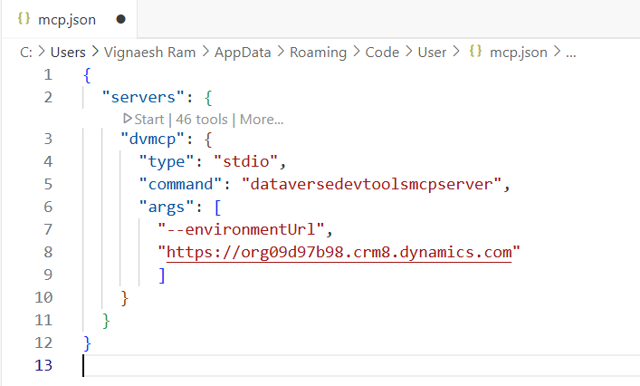
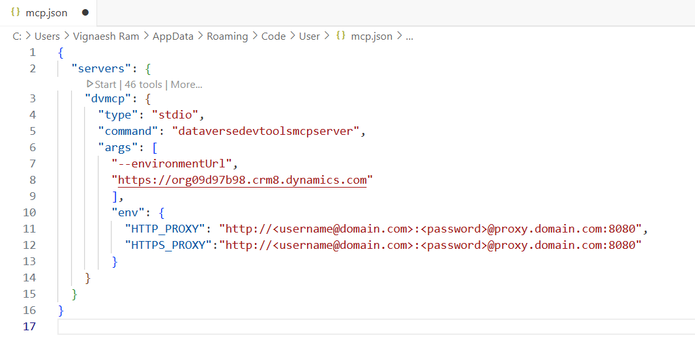
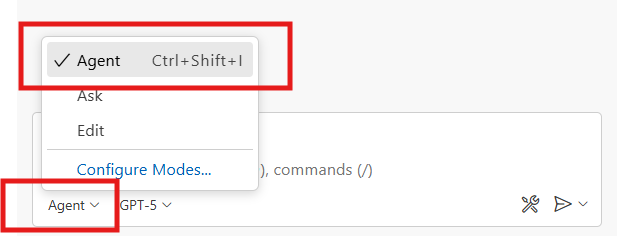
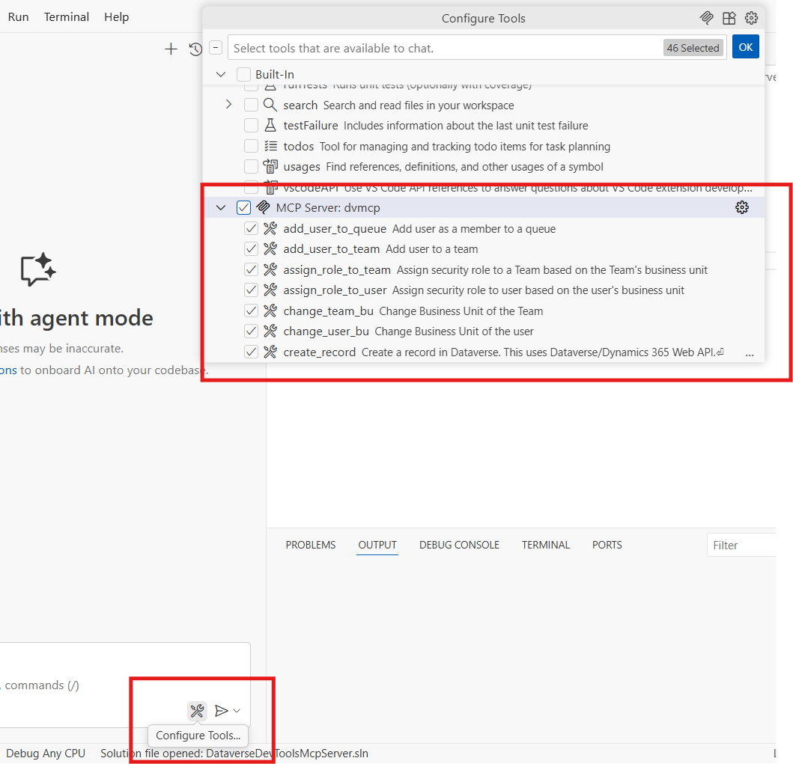
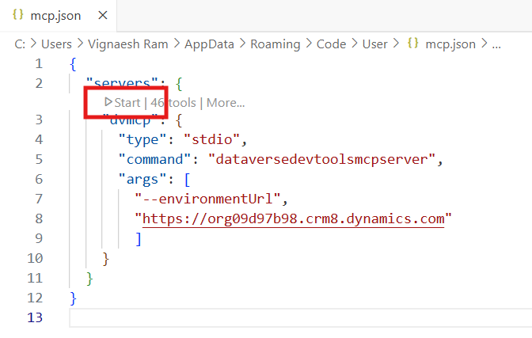

# Setup Dataverse DevTools MCP Server in VS Code

## Prerequisites

- .NET 8.0 SDK or later
- Install as global .NET tool

```
dotnet tool install --global vignaesh01.dataversedevtoolsmcpserver

```

## Enable MCP Support in VS Code

- Open View -> Command Palette -> Preferences: Open User Settings



- Filter Mcp . Set Chat > Mcp: Access to all



## Add MCP Server

- Open View -> Command Palette -> MCP: Open User Configuration. This opens the mcp.json file in your user profile. 



- You can then manually add the server configuration to the mcp.json file.



```
{
  "servers": {
    "dvmcp": {
      "type": "stdio",
      "command": "dataversedevtoolsmcpserver",
      "args": [
        "--environmentUrl",
        "https://<your-environment>.crm.dynamics.com"
        ]
    }
  }
}

```
For Corporate Proxy Network



```
{
  "servers": {
    "dvmcp": {
      "type": "stdio",
      "command": "dataversedevtoolsmcpserver",
      "args": [
        "--environmentUrl",
        "https://org09d97b98.crm8.dynamics.com"
        ],
        "env":{
          "HTTP_PROXY": "http://<username@domain.com>:<password>@<proxy.domain.com>:8080",
          "HTTPS_PROXY": "http://<username@domain.com>:<password>@<proxy.domain.com>:8080"
        }
    }
  }
}

```

## Use MCP Tools in Agent mode

Once you have added an MCP server, you can use the tools it provides in agent mode.

To use MCP tools in agent mode:

- Open the Chat view (Ctrl+Alt+I), and select Agent mode from the dropdown.



- Select the Tools button to view the list of available tools. Select the dvmcp tools.



- Start the dvmcp server.



- Dataverse DevTools MCP Server is ready to use.

**Note: If the agent is not able to pick up the MCP Server tools, mention "dataverse" or "dvmcp" in your prompt.**